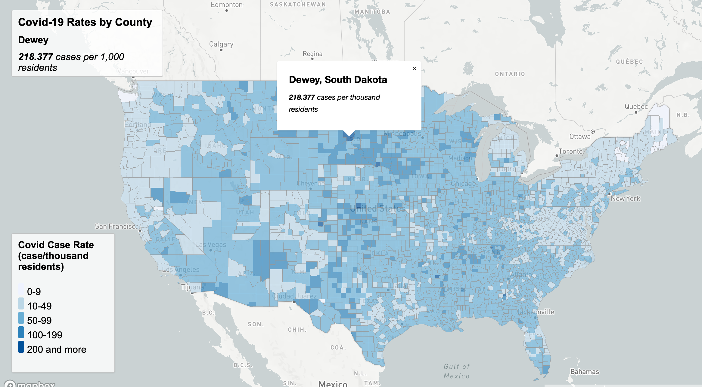
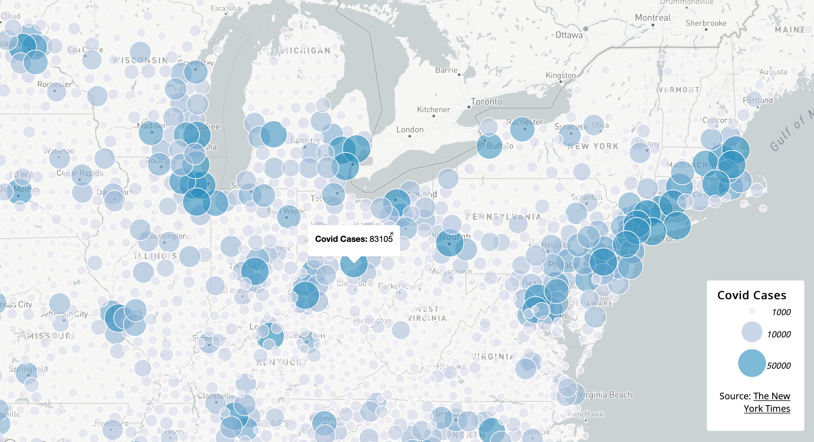

# CovidRatesCountsMap
Geog 458 Lab 3

For this project I created two online interactive maps dealing with New York Times Covid-19 data from 2020. 

<h3>
    Map 1:
</h3>

The first map I created, map1, was a choropleth map that displays Covid cases by 1 thousand residents. The darker the blue, the higher the number of cases there are in that county. I split the choropleth breaks into 5 different catagories that range from 0 to 200 cases. Using the mouse, you can hover over a county to see the covid rate along with the county that is being hovered over. When a county is clicked on, it shows the county, the state, and the covid cases in that county. 

https://wyattstanley.github.io/CovidRatesCountsMap/map1.html

 
 
 

<h3>
    Map 2:
</h3>

The second map I created, map2, is a proportional dot density map that shows the number of covid cases in an area. The map covers the United States and has circles all over the map. The larger and darker the circle gets, the more cases it represents. This map easily shows where most of the Covid cases were in 2020. When each dot is clicked on, it shows the number of cases in that area. I broke down the data into 3 main catagories, the first is displayed by the smallest circle which represents 1,000 Covid cases, the second is displayed by the second smallest circle which represents 10,000 cases, the final and largest circle represents 50,000 cases. 

https://wyattstanley.github.io/CovidRatesCountsMap/map2.html